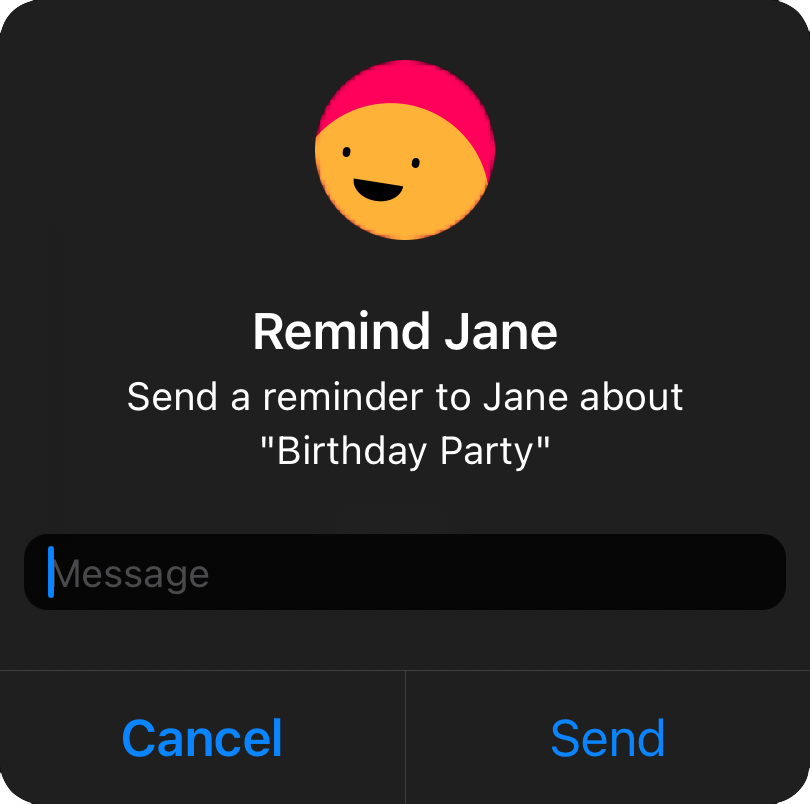
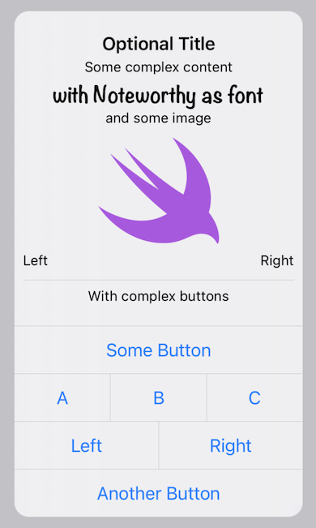
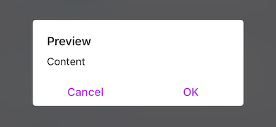
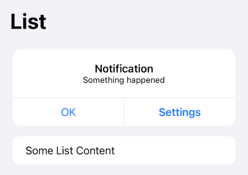

# CustomAlert

[](https://swiftpackageindex.com/divadretlaw/CustomAlert)
[](https://swiftpackageindex.com/divadretlaw/CustomAlert)

## Why

In iOS Alerts cannot contain Images or anything other than Text. This allows you to easily customize the message part with any custom view.

While the alert is completely rebuilt in SwiftUI, it has been designed to look and behave exactly like a native alert. The alert uses it's own window to be displayed and utilizes accessibility scaling but with the advantage of a custom view.

If the content is too large because the text is too long or the text doesn't fit because of accessibility scaling the content will scroll just like in a SwiftUI Alert.

## Usage

| SwiftUI Alert | Custom Alert |
|:-:|:-:|
|  |  |

You can easily add an Image or change the Font used in the alert, or anything else to your imagination.

Something simple with an image and a text field



Or more complex layouts



The API is very similar to the SwiftUI Alerts

```swift
.customAlert("Some Fancy Alert", isPresented: $showAlert) {
    Text("I'm a custom Message")
        .font(.custom("Noteworthy", size: 24))
    Image(systemName: "swift")
        .resizable()
        .scaledToFit()
        .frame(maxHeight: 100)
        .foregroundColor(.blue)
} actions: {
    Button {
        // some Action
    } label: {
        Label("Swift", systemImage: "swift")
    }
    
    Button(role: .cancel) {
        // some Action
    } label: {
        Text("Cancel")
    }
}
```

You can create Side by Side Buttons using `MultiButton`

```swift
.customAlert("Alert with Side by Side Buttons", isPresented: $showAlert) {
    Text("Choose left or right")
} actions: {
	MultiButton {
	    Button {
	        // some Action
	    } label: {
	        Text("Left")
	    }
	    
	    Button {
	        // some Action
	    } label: {
	        Text("Right")
	    }
    }
}
```

The alert is customizable via the `Environment`



```swift
.configureCustomAlert { configuration in
    // Adapt the default configuration
}
```

You can also display an Alert inline, within a `List` for example



```swift
InlineAlert {
    // Content
} actions: {
    // Actions
}
```

## Install

### SwiftPM

```
https://github.com/divadretlaw/CustomAlert.git
```

## License

See [LICENSE](LICENSE)

Copyright © 2022 David Walter (www.davidwalter.at)
