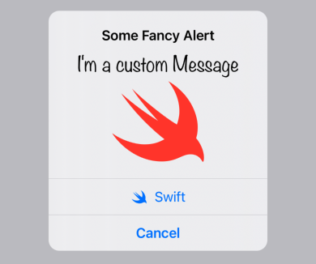

# CustomAlert

## Why

In iOS Alerts cannot contain Images or anything other than Text. This allows you to easily customize the message part with any custom view.

While the alert is completely rebuilt in SwiftUI, it has been designed to look and behave exactly like a native alert. The alert uses it's own window to be displayed and utilizes accessibility scaling but with the advantage of a custom view.

If the content is too large because the text is too long or the text doesn't fit because of accessibility scaling the content will scroll just like in a SwiftUI Alert.

## Usage

| SwiftUI Alert | Custom Alert |
|:-:|:-:|
|  |  |

You can easily add an Image or change the Font used in the alert, or anything else to your imagination.



The API is very similar to the SwiftUI Alerts

```swift
.customAlert("Some Fancy Alert", isPresented: $showAlert) {
    Text("I'm a custom Message")
        .font(.custom("Noteworthy", size: 24))
    Image(systemName: "swift")
        .resizable()
        .scaledToFit()
        .frame(maxHeight: 100)
        .foregroundColor(.blue)
} actions: {
    Button {
        // some Action
    } label: {
        Label("Swift", systemImage: "swift")
    }
    
    Button(role: .cancel) {
        // some Action
    } label: {
        Text("Cancel")
    }
}
```

## Install

### SwiftPM

```
https://github.com/divadretlaw/CustomAlert.git
```

## License

See [LICENSE](LICENSE)

Copyright © 2022 David Walter (www.davidwalter.at)